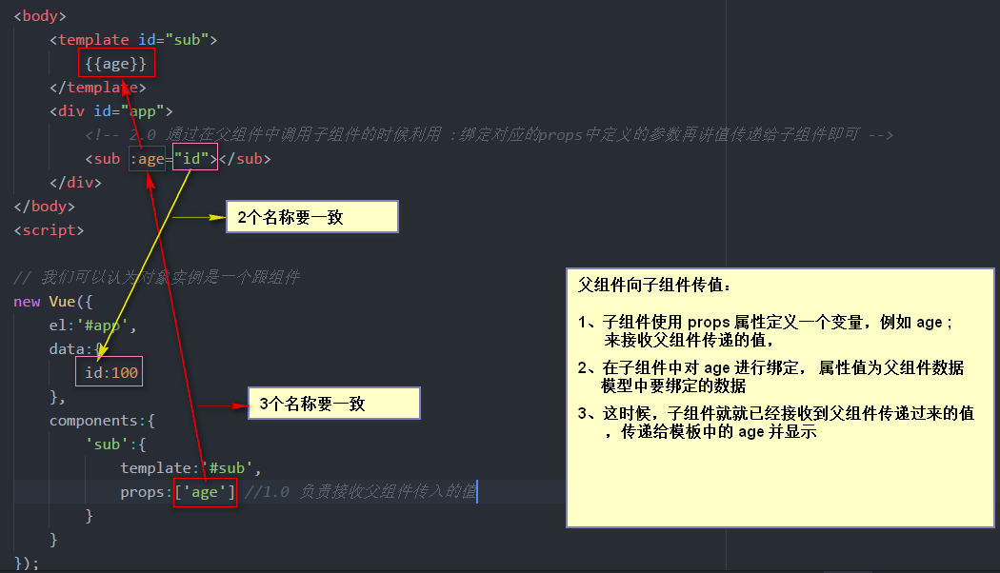
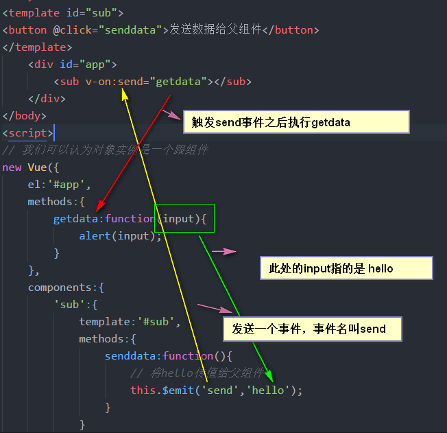

# 组件
### 什么是组件
- 组件（Component）是 Vue.js 最强大的功能之一。组件可以扩展 HTML 元素，封装可重用的代码。在较高层面上，组件是自定义元素，Vue.js 的编译器为它添加特殊功能。在有些情况下，组件也可以是原生 HTML 元素的形式，以 is 特性扩展

#### 使用
        1.0版本
- 定义组件
    + 可以用 Vue.extend() 创建一个组件构造器：
```javascript
   var MyComponent = Vue.extend({
  // 选项...
})
```
- 注册组件   
    + 要把这个构造器用作组件，需要用 Vue.component(tag, constructor) 注册  
```javascript
// 全局注册组件，tag 为 my-component
Vue.component('my-component', MyComponent)
```
    2.0版本
- 注册一个全局组件
    + 可以使用 Vue.component(tagName, options)    
```javascript   
Vue.component('my-component', {
  // 选项
})
```
#### 快捷方式
```javascript
Vue.component('名称',{
    // 选项

})
```
        *注意*
- 在2.0版本中创建组件时，需要使用一个根元素进行包裹

#### 局部注册---子组件
- 不需要全局注册每个组件。可以让组件只能用在其它组件内，用实例选项 components 注册：
- 就是在组件的内部再次注册组件
- 使用时也必须在父级组件的内部使用

#### 动态切换组件
```html
<!-- 使用component标签的 :is 绑定一个值 该 值为一个变量，用以切换显示组件 -->
<component :is="urlName"></component>
<!-- is内的值为哪一个组件的名称，显示的就是哪一个组件 -->
```

#### prop
- 使用 Props 传递数据给子组件
- 组件实例的作用域是孤立的。这意味着不能并且不应该在子组件的模板内直接引用父组件的数据。可以使用 props 把数据传给子组件。
    + 子组件接收数据需要显式地用 props 选项 声明 props：
    + prop 默认是单向绑定：当父组件的属性变化时，将传导给子组件，但是反过来不会

```html
<body>
    <template id="one">
        <div>{{ip}}</div>
    </template>
    <div id="app">
        <login :ip="age"></login>
        <!-- 设置ip 绑定age -->
    </div>
    <script>
        new Vue({
            el: '#app',
            data: {age:18,},
            components: {
                'login': {template: '#one',props:['ip']}
                },// props 接收的名称 要与 组件内绑定的名称相同
        })
    </script>
</body>
```


#####子组件向父组件传值
- 在子组件内声明并绑定一个方法
- 该方法调用时创建自定义事件this.$emit('事件名','传递的数据');
- 子组件通过自定义事件，将值通过事件方法传送到父组件内部用于接收的方法内，完成值的传递



##### 子组件引用
        2.0版本
- 尽管有 prop 和事件，但是有时仍然需要在 JavaScript 中直接访问子组件。为此可以使用 ref 为子组件指定一个引用 ID。例如：
```html
<div id="parent">
  <user-profile ref="profile"></user-profile>
</div>
```
```javascript
var parent = new Vue({ el: '#parent' })
// 访问子组件实例
var child = parent.$refs.profile
```
- 当 ref 和 v-for 一起使用时，获取到的引用会是一个数组，包含和循环数据源对应的子组件。
- $refs 只在组件渲染完成后才填充，并且它是非响应式的。它仅仅是一个直接操作子组件的应急方案——应当避免在模板或计算属性中使用 $refs

# 路由 
        vue-router
- 首先引入vue.js文件，然后再引入vue-router.js文件

- 定义vueRouter对象并且定义好路由规则清单

```javascript
var router = new VueRouter({
	routes:[
		{  
        path:'/login',  //路由规则的路径
		component:login
         },
		{
		path:'/register',  //路由规则的路径
		component:register
		}
	]
});

```
- 在vue对象中绑定router对象
```javascript
 new Vue({
  	el:'#app',
  	router:router
  });
```
- 嵌套路由
- 定义路由规则清单的时候，children下面的路由规则path中的文本字符串是不需要加/的，否则无效
- 嵌套路由的上层组件中的path要加 /，并且template中要增加<router-view></router-view> 用于显示内容
- 修改<router-link to="/上层路由path/子组件路由path">
- 路由的传参
    + 参数 path:'/login/:参数名'
- 参数的接收方式
    + {{this.$route.params.name}}
    + this.val = this.$route.params.name;

### watch
-  watch与computed均可以监控程序员想要监控的对象，当这些对象发生了改变以后，可以触发回调函数做一些逻辑处理

- watch的使用
    + 监听data中定义的属性 发生改变后执行函数
- watch 监测路由
    + 监听路由对象$route 发生改变后执行函数
### computer

- computer计算属性
    + 监听data中定义的属性 发生改变后执行函数